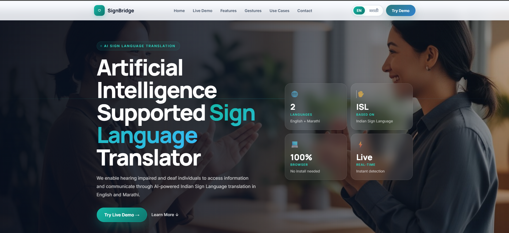
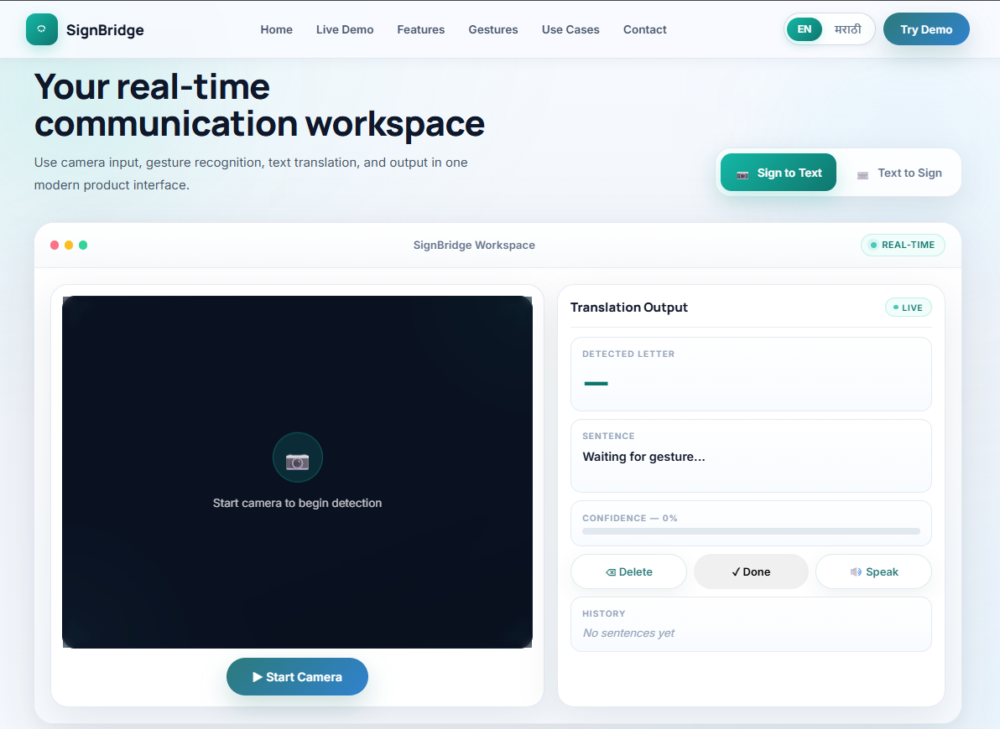

# 🤟 SignBridge – AI-Powered Sign Language Translator

SignBridge is a full-stack application that **translates sign language gestures into text and speech in real-time**, improving communication accessibility for hearing-impaired individuals. The system leverages computer vision and machine learning to recognize hand gestures and convert them into meaningful output.

---

## 🚀 Features

* 🤟 **Real-time Sign Language Recognition** using webcam input
* 🧠 **Hand Landmark Detection** with MediaPipe
* 🔤 **Gesture-to-Text Conversion** using ML models
* 🔊 **Text-to-Speech Output** for audible feedback
* 🔁 **Text-to-Sign Module** (GIF-based visualization)
* ⚡ **Low-latency Processing** for smooth real-time interaction
* 🌐 **Full-stack Integration** with REST APIs

---

## 🧠 How It Works

### 🔹 Gesture Recognition

* Captures live video input
* Detects hand landmarks using MediaPipe
* Extracts features using OpenCV

### 🔹 Classification

* Trained ML models (Random Forest / Deep Learning) classify gestures
* Outputs corresponding text

### 🔹 Output Generation

* Converts text → speech
* Displays text on UI
* Maps text → sign animations (GIFs)

---

## 🖼️ UI Screenshots







> 📌 Place your images inside an `assets/` folder in the root of your repository.

---

## 🏗️ Architecture

```text
Frontend (React.js)
       ↓
Backend (Node.js + Express)
       ↓
ML Module (Python)
       ↓
OpenCV + MediaPipe + ML Model
```

---

## 🛠️ Tech Stack

### Frontend:

* React.js

### Backend:

* Node.js
* Express.js

### Machine Learning:

* Python
* OpenCV
* MediaPipe
* scikit-learn
* TensorFlow

---

## 📁 Project Structure

```text
signbridge/
│
├── frontend/          
├── backend/           
├── ml-model/          
│   ├── training/
│   ├── inference/
│
├── assets/            # UI screenshots + GIFs
└── README.md
```

---

## ⚙️ Installation & Setup

### 🔹 Clone Repository

```bash
git clone https://github.com/your-username/signbridge.git
cd signbridge
```

---

### 🔹 Backend Setup

```bash
cd backend
npm install
npm start
```

---

### 🔹 Frontend Setup

```bash
cd frontend
npm install
npm start
```

---

### 🔹 ML Module Setup

```bash
cd ml-model
pip install -r requirements.txt
python app.py
```

---

## 🧪 Usage

1. Open the web application
2. Allow webcam access
3. Perform sign gestures
4. View:

   * Detected text
   * Speech output
   * Corresponding sign animation

---

## 📊 Model Details

* Algorithms used:

  * Random Forest
  * Deep Learning
* Input:

  * Hand landmark coordinates
* Output:

  * Gesture classification

---

## ⚡ Performance

* Real-time inference with minimal latency
* Accurate hand tracking using MediaPipe
* Optimized pipeline for smooth user experience

---

## 🎯 Use Cases

* Accessibility tools for hearing-impaired individuals
* Educational applications
* Assistive AI communication tools

---

## 🔥 Future Improvements

* 📱 Mobile app integration
* 🌍 Multi-language support
* 🤖 Improved deep learning models
* ☁️ Cloud deployment

---

## 🙌 Acknowledgements

* MediaPipe
* OpenCV
* scikit-learn
* TensorFlow

---

## 📬 Contact

Developed by **Yash Bhate** 🚀
